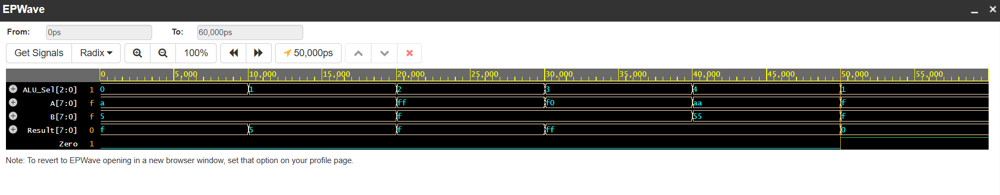

# 8-Bit Arithmetic Logic Unit (ALU) 🧮

A parameterizable 8-bit ALU written in Verilog, supporting basic arithmetic and bitwise logic operations. 

**Supported Operations**
* `ADD` (000)
* `SUB` (001)
* `AND` (010)
* `OR`  (011)
* `XOR` (100)

**Simulation**
Simulated using Icarus Verilog. The testbench verifies all operations, tracking the inputs, operation selector, result, and the Zero flag.

**Waveform**
